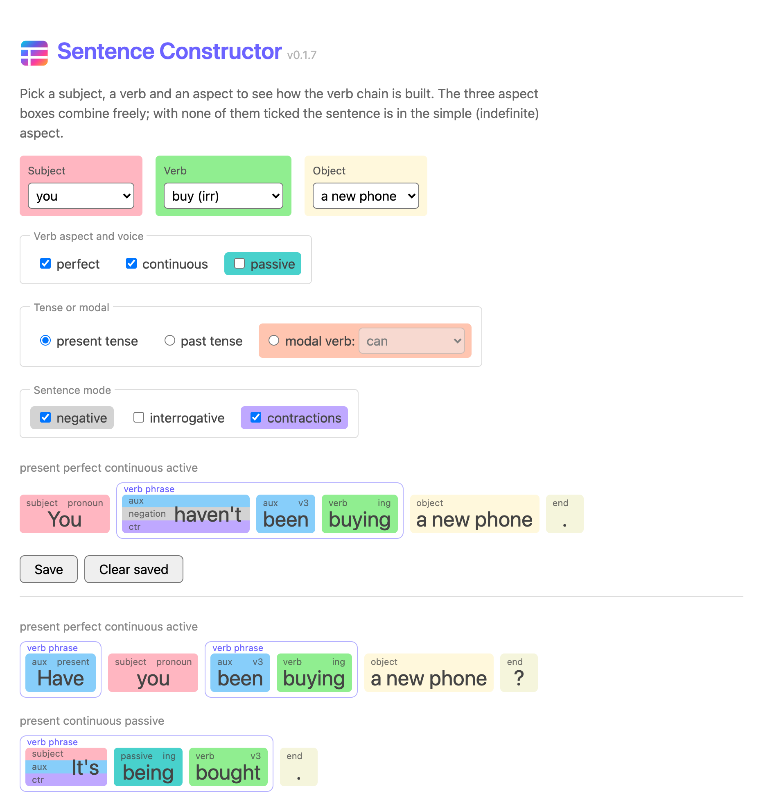

# Sentence Constructor

[](https://github.com/axln/eng-tense-aspect/actions/workflows/deploy.yml)

**An interactive replacement for the big English tense tables.** Pick a subject, a verb and an aspect, and the app builds the sentence and shows how it is put together: every word sits in a tile coloured and labelled by its grammatical role, and a chain of verbs like *have been going* is framed as the single verb phrase it really is.

**Try it: https://axln.github.io/eng-tense-aspect/**



It is made for learners of English as a second language and for the people who teach them, so it sticks to everyday modern English: no `amn't`, no `shan't`, and nothing a learner would be marked wrong for saying.

## What it does

- **Builds a sentence from choices.** Subject (7 pronouns), verb (114, regular and irregular), an optional object, present or past tense or one of 11 modal verbs.
- **The three aspects are independent checkboxes:** *perfect*, *continuous* and *passive*. Tick any combination; tick none and you get the simple (indefinite) aspect. All three together (*has been being asked*) is allowed, since English permits it, and is marked as rarely used.
- **Negative, question and contractions** are options on top of that. Each combination follows the real rules, for example do-support (*Does she have a car?*) and the two ways English fills the gap where *amn't* would be.
- **Shows the structure.** Each word is a tile coloured by its role (subject, verb, auxiliary, passive, modal, negation, object), and the controls that pick a part of the sentence use the same colour as the tile they produce.
- **Frames the verb phrase.** In English a chain of verbs works as one verb: only the first word takes the tense and the agreement. The chain is drawn inside one frame titled *verb phrase*. In a question the subject moves into the chain (*Have **you** been going?*), so the phrase is split in two and both halves carry the same title.
- **Shows what a contraction is made of.** *I'm* is drawn as one unbroken word on horizontal stripes: the subject *I*, the auxiliary *'m*, and a lavender stripe that says it is a contraction.
- **Shows the forms of a verb as a chart.** The *forms* link in the corner of the verb field opens an "elementary chart" of the verb: the base form in the middle, the finite forms on the left and the participles on the right, present above and past below (*go / goes, going, went, gone*).
- **Saves sentences** so you can put several side by side and compare them.

## Run it locally

You need Node.js (CI uses 24) and [Yarn Classic](https://classic.yarnpkg.com/).

```bash
yarn install
yarn dev          # http://localhost:5173/eng-tense-aspect/
```

The site is served from a sub-path on GitHub Pages, so the local URL has it too.

| Command | What it does |
|---|---|
| `yarn dev` | Vite dev server with hot reload |
| `yarn build` | Production build into `dist/` |
| `yarn preview` | Serve the production build |
| `yarn test` | Run the tests once (`yarn test:watch` to keep them running) |
| `yarn run check` | Type check with `svelte-check` and `tsc` |

## How it is built

**Svelte 5, Vite, TypeScript, Tailwind CSS v4 and Vitest.** There is no backend: it is a static site.

The interesting part is a small grammar engine in `src/lib/` that has no dependency on the UI:

```
choices  ->  SentenceSpec  ->  buildSentence  ->  Word[]  ->  tiles
```

`buildSentence` builds the verb chain from the aspect flags, adds `do` when a negative or a question needs it, agrees the first verb with the subject, places the subject and the object, and applies the contraction rules. It returns a list of words, each with a role, and the UI only draws that list. Contracted words carry the roles of the words they were made from, which is how the stripes are known.

```
src/
  App.svelte        the page and its controls
  component/        Sentence.svelte, Word.svelte (the tiles and the frames)
  lib/              the grammar engine, with its tests beside it
  spelling/         verb lists, contraction rules, sample objects for each verb
  type.ts           Word, WordRole and friends
docs/               the screenshot above
scripts/            bump-version.mjs, used by the deploy workflow
```

### Tests

The English is tested, not just the code. Besides hand-picked cases (*I have a car*, never *I've a car*; *must not* gives *mustn't* but *shall not* never gives *shan't*), the tests sweep tens of thousands of combinations of subject, verb, tense, aspect, voice and sentence type, and check the rules that must hold in all of them: no archaic forms, no contraction of a stranded verb, and that the parts of a contracted word spell the word exactly. Every verb in the lists is checked against the spelling rules too, so a verb added with a missing form fails a test instead of showing *catchs* on screen.

## Deployment

Every push to `main` runs [`.github/workflows/deploy.yml`](.github/workflows/deploy.yml): install, bump the patch version, type check, test, build, and publish `dist/` to GitHub Pages. A type error or a failing test stops the deploy. The version is shown next to the title, and after each deploy the workflow commits the bump back to `main`, so pull before you push.

To deploy your own copy, set the repository's Pages source to **GitHub Actions** (Settings → Pages) and change `base` in `vite.config.ts` to your repository name.

## Notes for AI assistants

[`CLAUDE.md`](CLAUDE.md) holds the working notes for Claude Code: the architecture, the grammar decisions and the reasons behind them, and the traps that are easy to fall into.

## License

[MIT](LICENSE)
